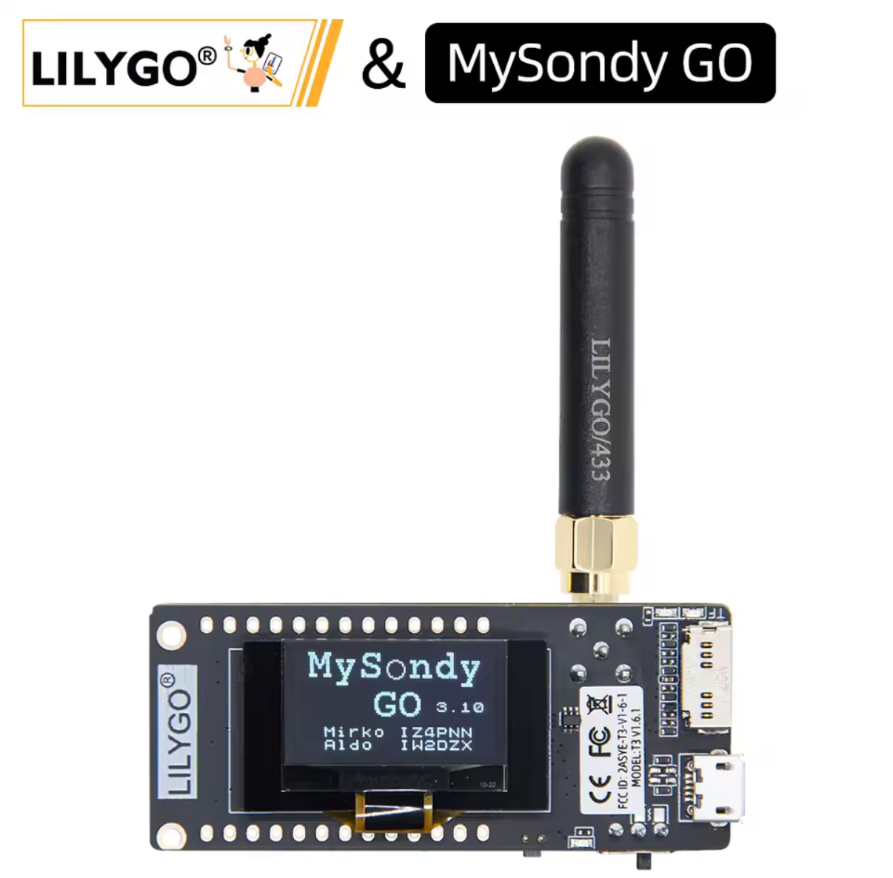

# 

🔗  

**MySondy GO** is a FREE project that allows receiving, decoding, and visualizing signals from **weather radiosondes** (e.g., RS41) using a **TTGO LoRa32 433 MHz board** (ESP32) and a dedicated mobile app.

It consists of:  
✔ A **firmware** to upload to the TTGO board  
✔ A **mobile app** for viewing and controlling via Bluetooth  
✔ Documentation and installation instructions  
✔ Releases maintained by **Mirko Dalmonte (IZ4PNN)** with other contributors.

---

## 🔧 Main Features

✅ Works with **TTGO LoRa32 433 MHz**  
✅ Decodes radiosonde signals  
✅ Bluetooth connection to smartphone  
✅ Real-time data and telemetry visualization  
✅ BLE support also for iOS (recent versions)  
✅ Firmware updatable directly from the app (Android devices only).

---

## 📡 Components

### 🛠 Required Hardware

- **TTGO LoRa32 433 MHz** (ESP32 + LoRa)  
  🔗 https://www.aliexpress.com/item/1005009178059360.html

  (The authors do not receive money for the sales generated by this link.)
  
- PC for flashing firmware (Windows, Mac, Linux)  
- USB cable to connect the device  
- (Optional) External antenna for better reception. 

### 📱 Software

#### 📲 Mobile App

The **MySondy GO app** is available on:

- **Android** → Google Play Store  
- **iOS / iPadOS** → Apple App Store  

The app allows you to:  
- Search for the device via Bluetooth  
- Set frequency and radiosonde type  
- Visualize data as it is received

#### 🧰 Firmware

The TTGO firmware receives radio signals and sends them via Bluetooth to the app.  
Firmware is available for download on the official project site and on this public repo:

<a href="https://github.com/MirkoDalmonte/MySondyGO-Release/releases/latest/download/MySondyGO.zip">🔗 THE LATEST FIRMWARE BIN</a>

<a href="https://github.com/MirkoDalmonte/MySondyGO-Release/releases/latest/download/MySondyGO-FULL.zip">🔗 LATEST FIRMWARE, MANUALS, TOOLS</a>

🔗  

---

## 🚀 Installation

### 1. Hardware setup

1. Connect the **TTGO LoRa32** board to your PC via USB  
2. Install necessary drivers (e.g., CP2102 / CH340)  
3. Install flash_download_tool or esptool (command line)

### 2. Flash the firmware

Upload the firmware using:

- **flash_download_tool**
 
  (This repo provides all the information to flash the TTGO with the latest available firmware).
 

- or **esptool.py** via command line  
  esptool.py --chip esp32 --port /dev/ttyUSB0 write_flash 0x0000 MySondyGO.bin
  
  (Replace /dev/ttyUSB0 with the correct port on your system (COMx on Windows).

  
### 3. Launch the app

1. Open the MySondy GO app  
2. Turn on Bluetooth  
3. Turn on TTGO (no pair required)
4. Set the frequency and radiosonde type

---

## 🗂 Repository Structure

This repository contains:

📦 **Firmware Only** for TTGO LoRa32:
   <a href="https://github.com/MirkoDalmonte/MySondyGO-Release/releases/latest/download/MySondyGO.zip">MySondyGO.zip</a>
   
  (MySondyGO.zip contains the firmware ONLY).  

📦 **Complete package** for TTGO LoRa32:
   <a href="https://github.com/MirkoDalmonte/MySondyGO-Release/releases/latest/download/MySondyGO-FULL.zip">MySondyGO-FULL.zip</a>

   (MySondyGO-FULL.zip contains everything you need to flash the TTGO: firmware, software, drivers and manuals).
   
---

## 📥 Download

All documentation, firmware binaries, manuals are available on this repo and on the official project site:

🔗 

🔗  Official website & download: https://mysondy.altervista.org/mysondygo.php

---

## 📡 Contributors & Credits

Main contributor:  
**Mirko Dalmonte (IZ4PNN)**  
Collaborators:  
Aldo Moroni (IW2DZX), Jordan Antonio Provesi (IZ2ZUZ),  
Achille De Santis (IU0EUF), Anthony Le Cren (F4GOH)

---

## 📎 Useful Links

🔗 Official website & download: https://mysondy.altervista.org/mysondygo.php  

🔗 Support forum: https://mysondy.altervista.org/Forum/

🔗 Link to buy: https://www.aliexpress.com/item/1005009178059360.html

(The authors do not receive money for the sales generated by this link.)

## 📲 MySondy GO App Download

## DONATIONS

**If you like our work, please buy us a beer!**

